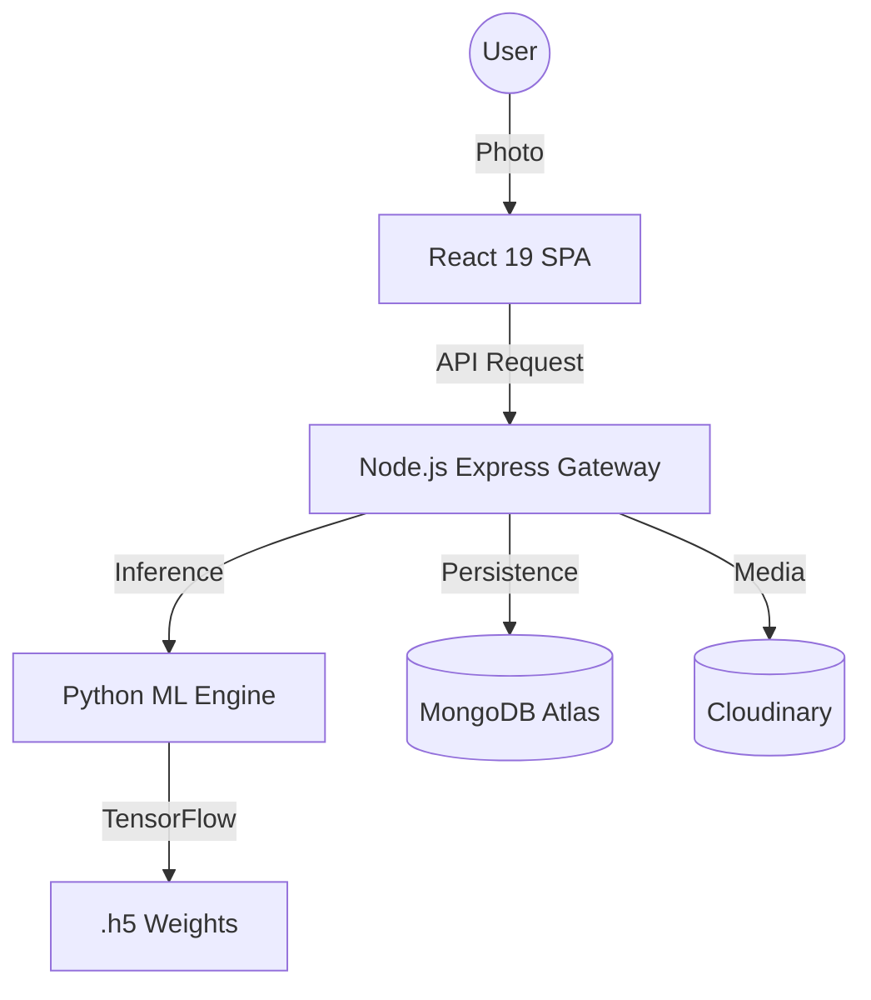

<div align="center">
  
  <h1>BloomSkin 🌸</h1>
  <p><strong>The Future of AI-Powered Dermatology</strong></p>
  <p><i>Transforming any smartphone into a clinical-grade skin diagnostic tool.</i></p>

  <div>
    
    
    
    
  </div>
</div>

---

## 🔬 The Vision
BloomSkin isn't just an app; it's a personalized skincare journey. By combining **Deep Learning (CNNs)** with a medical-grade knowledge base, we provide sub-second analysis and adaptive routines that evolve with your skin.

### 🌐 Live Ecosystem
- **Frontend Hub:** [https://bloomskin.vercel.app/](https://bloomskin.vercel.app/)
- **API Engine:** [https://bloom-skin-backend.onrender.com/](https://bloom-skin-backend.onrender.com/)

---

## 🌟 Key Pillars

### 1. Precision AI Scanning
Our custom-trained **Convolutional Neural Network** detects Acne, Cysts, Papules, and Pustules with clinical-grade accuracy. Integrated MTCNN face detection ensures perfect scan framing every time.

### 2. High-Fidelity Dashboard
A "Better than Premium" data hub tracking your **Bloom Score**, severity trends, and scan streaks. Real-time sparklines visualize your improvement over time.

### 3. Smart Routine Logic
A 7-day adaptive planner that synchronizes with your latest scan. If your skin changes, your routine changes automatically.

---

## 🏗️ Architecture



---

## 🛠️ Tech Stack

| Layer | Technologies |
|---|---|
| **Frontend** | React 19, Vite, Tailwind CSS v4, Framer Motion, Lucide Icons |
| **Backend** | Node.js, Express, Passport.js (OAuth 2.0), JWT, Mongoose |
| **Machine Learning** | Python, TensorFlow/Keras, Flask, OpenCV, MTCNN |
| **DevOps** | Vercel (Frontend), Render (Backend/ML), GitHub Actions |

---

## ⚡ Deployment (Unified Monorepo)

BloomSkin is built as a **Monorepo**. Deploying changes to both the frontend and backend is as simple as one push from the root folder.

### 1. Initial Setup
```bash
git clone https://github.com/rasikarakhewar3010/Bloom-Skin.git
cd Bloom-Skin
```

### 2. Unified Push
```bash
git add .
git commit -m "feat: updated dashboard logic"
git push
```

> [!TIP]
> **Render (Backend):** Use the `render.yaml` Blueprint or set `rootDir: backend` in manual settings.
> **Vercel (Frontend):** Set the **Root Directory** to `frontend` in Project Settings.

---

## 📂 Project Structure
```text
BloomSkin/
├── backend/             # Node.js API & Business Logic
├── frontend/            # React 19 Boutique UI
├── bloom-skin-ml/       # TensorFlow Inference Service
└── render.yaml          # Unified Deployment Blueprint
```

---

## 🔐 Security Standards
- **Defense-in-Depth:** Helmet.js headers & Rate limiting.
- **Identity:** Secure Google OAuth 2.0 & HttpOnly Session Cookies.
- **Safety:** Cloudinary virus scanning & Multer MIME type filtering.

---

<div align="center">
  <p><i>© 2026 BloomSkin Inc. Developed for precision skin health.</i></p>
</div>
